# Transfer functions of various MoogLadder filters

Filter parameters:
* cutoff frequency: 500 Hz, 1 kHz, 5 kHz, 10 kHz, 15 kHz
* resonance: 0.9 (90%)
* sampling frequency: 96 kHz

All plots are created by passing an unit amplitude impulse
through the filter, computing FFT of length 4096
from the filter output and plotting the absolute value
(the magnitude response). The filter is double sampled,
operating at 96 kHz sample rate. The target sample rate is 48 kHz.

Expected results:
* resonance peaks at the design cutoff frequencies
* high resonance peaks (resonance close to 1)
* the same peak level for all cutoff values
* equal Q for all peaks (constant peak width on the logarithmic scale)

## DangeloModel

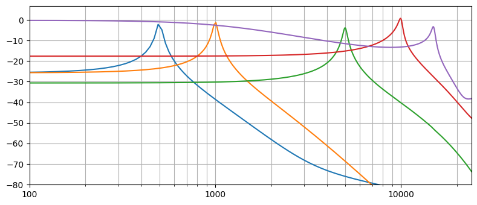

## HuovilainenModel

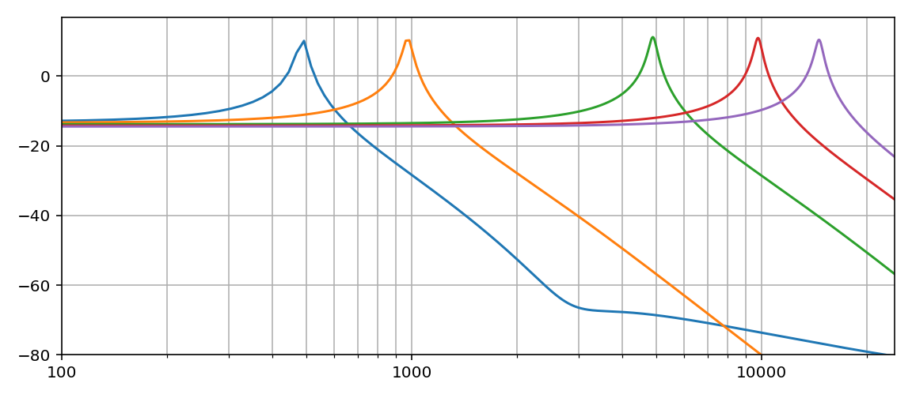

## ImprovedModel

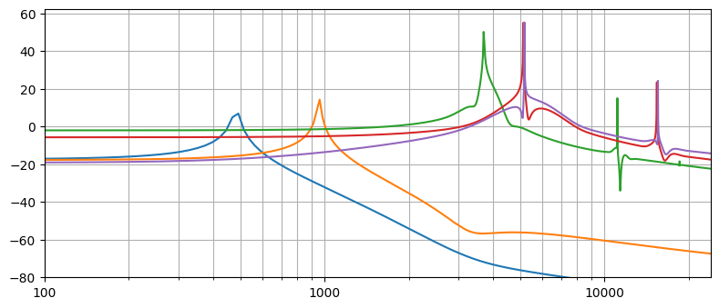

## KrajeskiModel

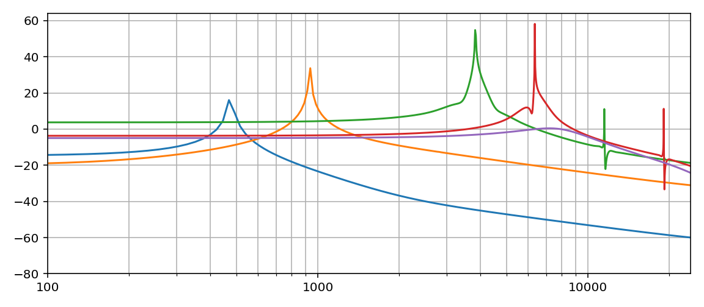

## MicrotrackerModel

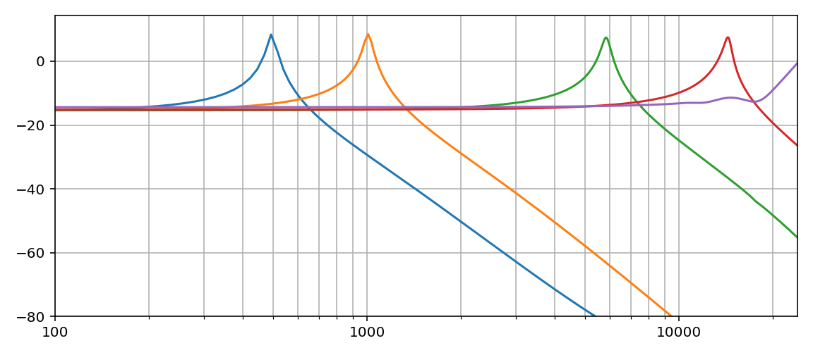

## MusicDSPModel

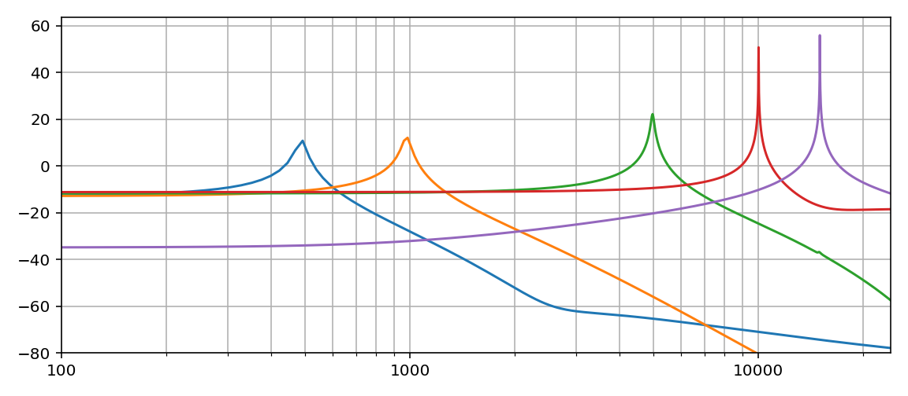

## OberheimVariationModel

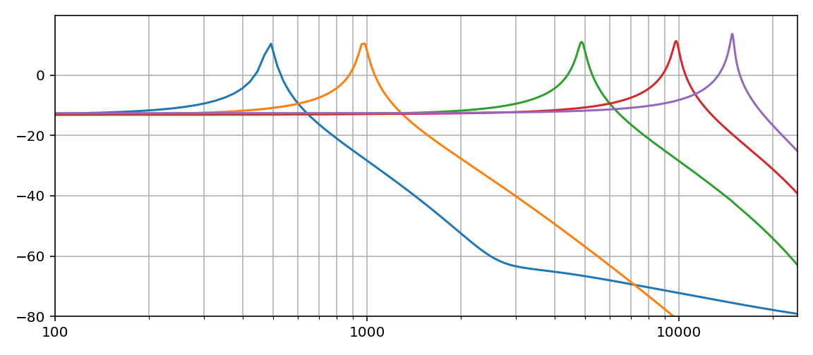

## RKSimulationModel

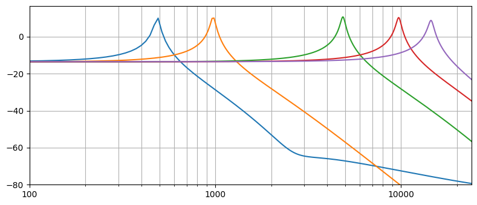

## SimplifiedModel

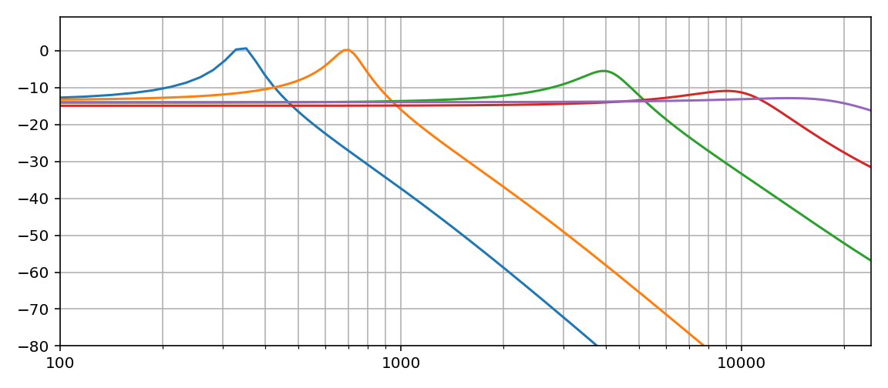

## StilsonModel

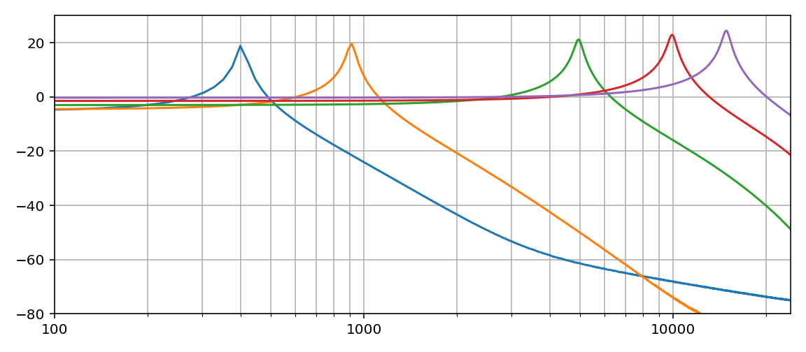

## ValimakiModel

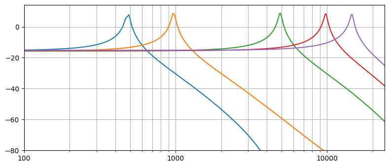

