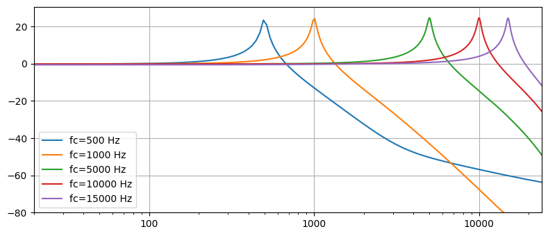
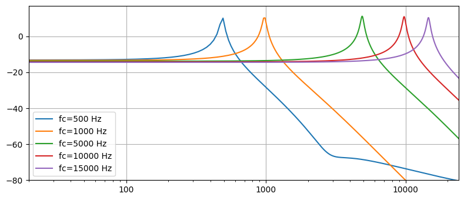
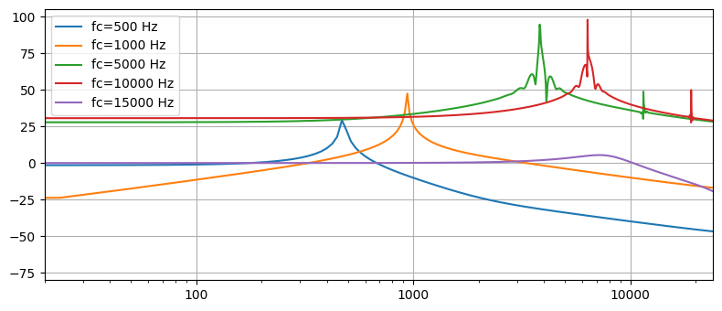
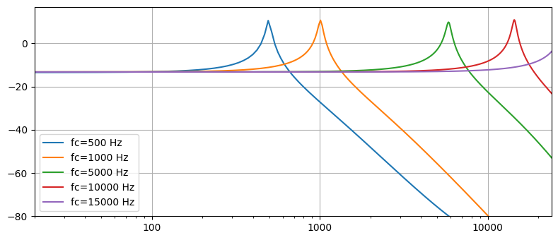
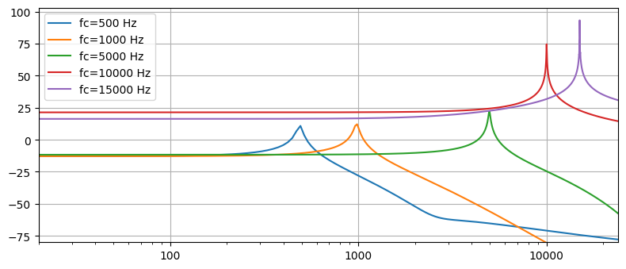
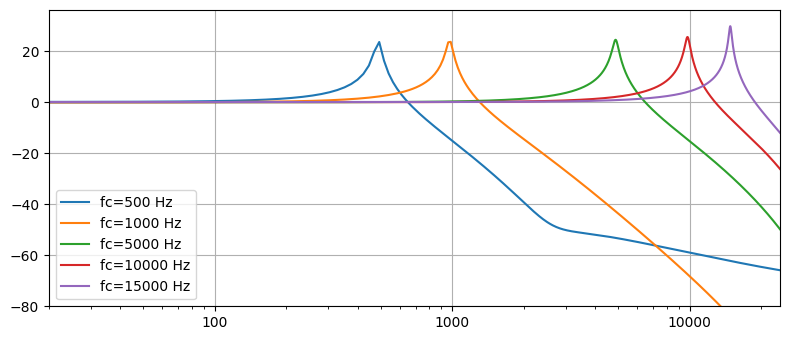
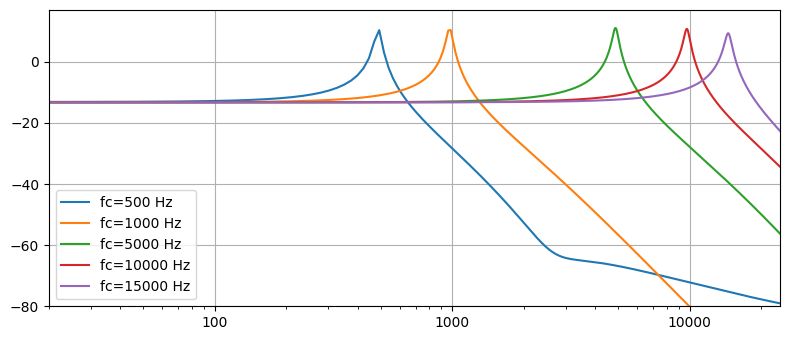
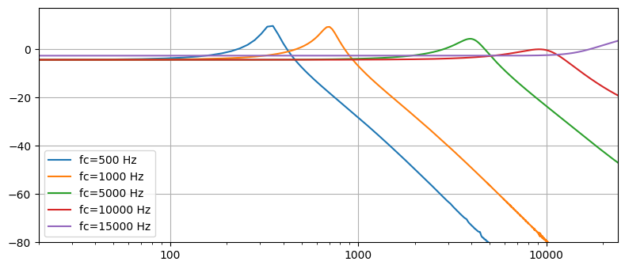
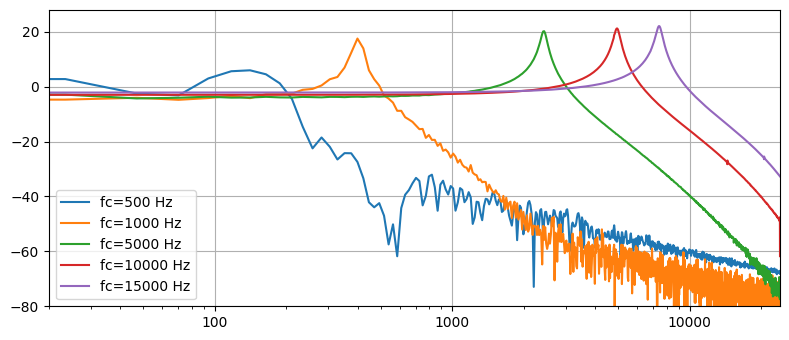
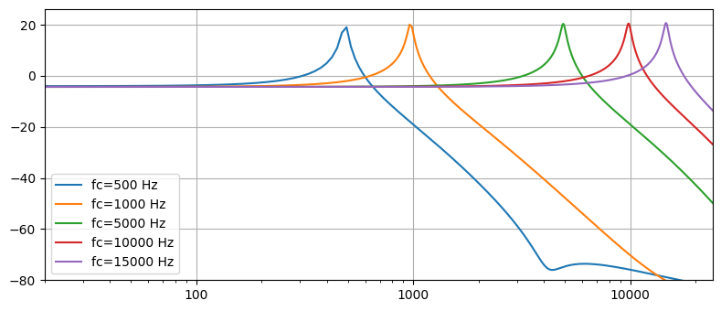

# Transfer functions of various MoogLadder filters

Filter parameters:
* cutoff frequency: 500 Hz, 1 kHz, 5 kHz, 10 kHz, 15 kHz
* resonance: 0.9 (90%)
* sampling frequency: 88 kHz

Expected results:
* resonance peaks at the design cutoff frequencies
* high resonance peaks (resonance close to 1)
* the same peak level for all cutoff values
* equal Q for all peaks (constant peak width on the logarithmic scale)

## DangeloModel

## HouvilainenModel

## ImprovedModel

## KrajeskiModel

## MicrotrackerModel

## MusicDSPModel

## OberheimVariationModel

## RKSimulationModel

## SimplifiedModel

## StilsonModel

## ValimakiModel

